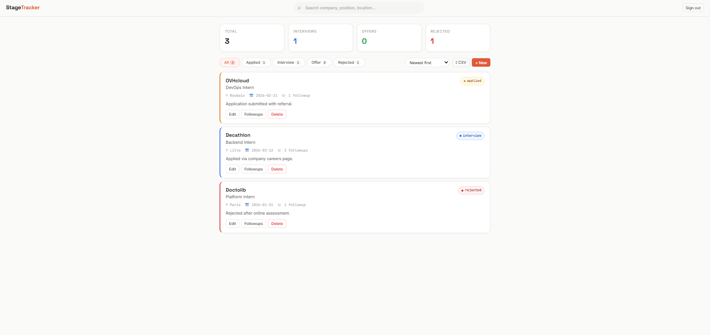
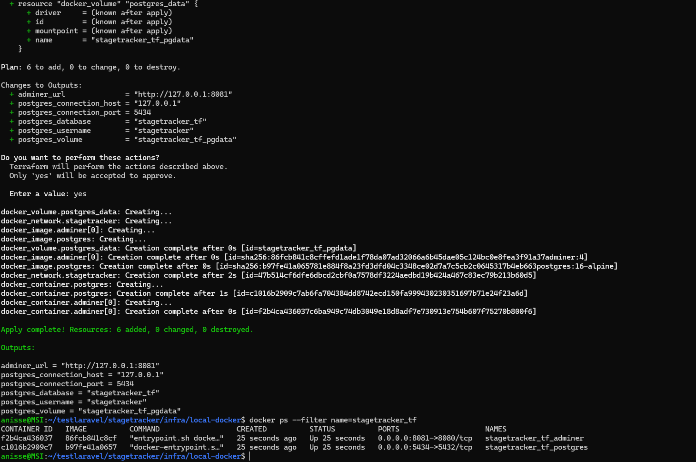

# StageTracker API

API REST Laravel pour gerer ses candidatures de stage, avec interface web de test.



## Apercu Terraform



## Quick Start (Docker)

```bash
cd ~/testlaravel/stagetracker
cp .env.docker .env
docker-compose up -d --build
docker-compose exec app composer install --no-interaction --prefer-dist
docker-compose exec app php artisan key:generate
docker-compose exec app php artisan migrate --seed
```

URLs:

- App / UI: http://localhost:8000
- Swagger UI: http://localhost:8000/api/documentation

Comptes de demo:

- `demo1@stagetracker.test` / `password123`
- `demo2@stagetracker.test` / `password123`

Arret:

```bash
docker-compose down
```

Reset complet (supprime la DB Compose):

```bash
docker-compose down -v
```

## Quick Start (Docker + DB Terraform)

1. Demarrer l'infra Terraform locale (PostgreSQL + Adminer):

```bash
cd ~/testlaravel/stagetracker/infra/local-docker
cp terraform.tfvars.example terraform.tfvars
# adapte postgres_password si besoin
terraform init
terraform apply -lock=false
```

2. Demarrer l'UI Docker Compose connectee a la DB Terraform:

```bash
cd ~/testlaravel/stagetracker
TF_DB_PASSWORD=change_me ./scripts/up-compose-with-terraform-db.sh
```

3. Arret du mode combine:

```bash
cd ~/testlaravel/stagetracker
./scripts/down-compose-with-terraform-db.sh
cd infra/local-docker
terraform destroy -lock=false
```

Notes:

- Le mode combine n'utilise pas le service `db` de `docker-compose.yml`.
- L'app Docker vise par defaut `host.docker.internal:5434`.
- Tu peux overrider via `TF_DB_HOST`, `TF_DB_PORT`, `TF_DB_DATABASE`, `TF_DB_USERNAME`, `TF_DB_PASSWORD`.
- Pour le detail Terraform (cycle, state, depannage): [infra/local-docker/README.md](infra/local-docker/README.md)

## Stack

- PHP 8.3
- Laravel 12
- PostgreSQL
- Authentification: Laravel Sanctum (Bearer token)
- Documentation: Swagger / OpenAPI
- Tests: PHPUnit
- CI: GitHub Actions

## Fonctionnalites

- Register / Login / Logout
- CRUD candidatures
- CRUD followups (email, call, linkedin)
- Export CSV
- Interface web sur `/` pour test manuel
- Isolation par utilisateur (chaque user ne voit que ses donnees)

## Authentification

- Header requis sur routes protegees: `Authorization: Bearer <token>`
- Pas de flow SPA cookie/CSRF pour le front de ce projet

Exemple login:

```bash
curl -X POST http://localhost:8000/api/login \
  -H "Content-Type: application/json" \
  -H "Accept: application/json" \
  -d '{"email":"demo1@stagetracker.test","password":"password123"}'
```

## Endpoints

| Methode | URI | Description | Auth |
|---|---|---|---|
| `POST` | `/api/register` | Inscription + token | Public |
| `POST` | `/api/login` | Connexion + token | Public |
| `POST` | `/api/logout` | Deconnexion | Token |
| `GET` | `/api/applications` | Liste (paginee, filtrable) | Token |
| `POST` | `/api/applications` | Creer une candidature | Token |
| `GET` | `/api/applications/{id}` | Detail candidature | Token |
| `PATCH` | `/api/applications/{id}` | Modifier candidature | Token |
| `DELETE` | `/api/applications/{id}` | Supprimer candidature | Token |
| `GET` | `/api/applications/export.csv` | Export CSV | Token |
| `GET` | `/api/applications/{id}/followups` | Liste followups | Token |
| `POST` | `/api/applications/{id}/followups` | Ajouter followup | Token |
| `DELETE` | `/api/followups/{id}` | Supprimer followup | Token |

## Tests

Local:

```bash
php artisan test
```

Avec Docker:

```bash
docker-compose exec app php artisan test
```

Etat actuel:

- 19 tests passent
- dont 17 tests API dans `StageTrackerApiTest`

## CI

- Tests app: `.github/workflows/tests.yml`
- Checks Terraform (fmt/init/validate): `.github/workflows/terraform.yml`
- Aucun `terraform apply` n'est execute en CI

## Installation locale (sans Docker, optionnelle)

```bash
cd ~/testlaravel/stagetracker
composer install
cp .env.example .env
php artisan key:generate
php artisan migrate --seed
php artisan serve
```

## Exemples API (curl)

Creer une candidature:

```bash
curl -X POST http://localhost:8000/api/applications \
  -H "Authorization: Bearer TOKEN" \
  -H "Content-Type: application/json" \
  -H "Accept: application/json" \
  -d '{
    "company": "Google",
    "position": "Backend Intern",
    "location": "Paris",
    "status": "applied",
    "applied_at": "2026-02-10",
    "notes": "Applied via careers page."
  }'
```

Export CSV:

```bash
curl http://localhost:8000/api/applications/export.csv \
  -H "Authorization: Bearer TOKEN" \
  -o applications.csv
```
